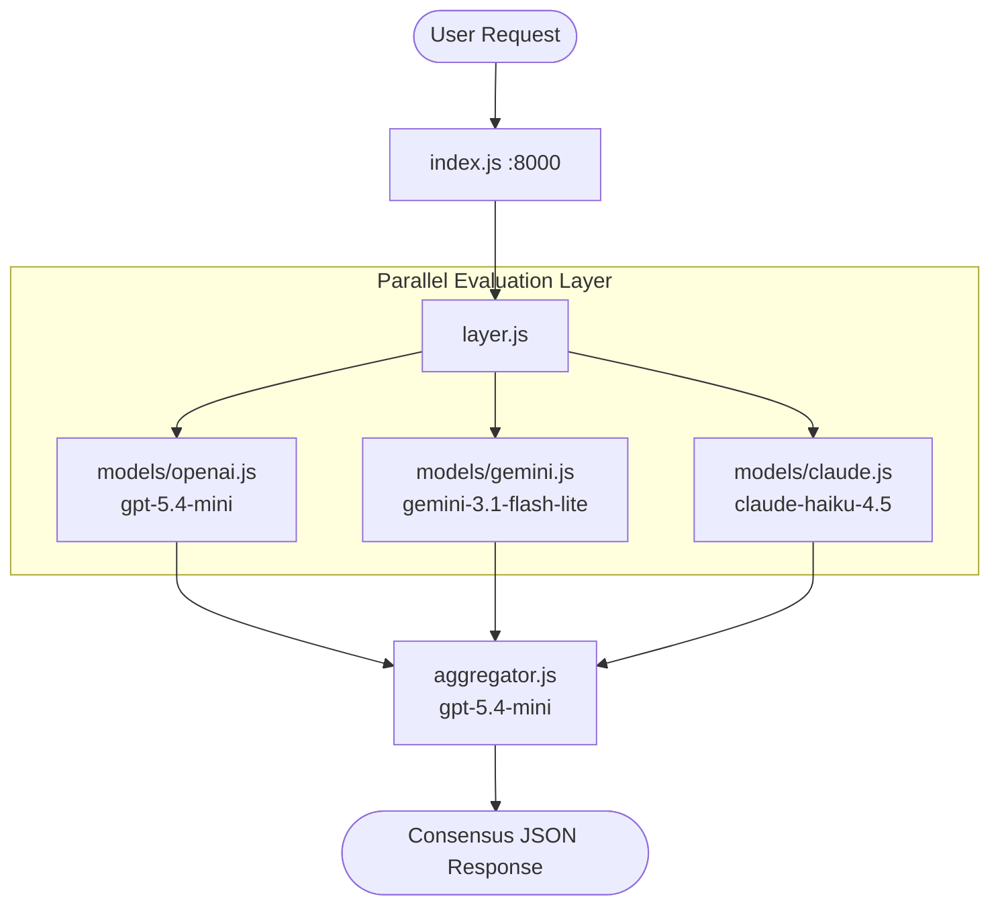

# Multi-Model Consensus Pipeline (Backend)

An intelligent consensus system that queries multiple LLMs in parallel and uses a superior model as a judge to evaluate, select, or synthesize the best final response.

---

## 🚀 Architecture



1. **Client Request**: The client sends a question/prompt to the Express backend.
2. **Parallel Model Layer**: The backend queries three major models concurrently:
   - OpenAI (`gpt-5.4-mini`) via [openai.js](file:///home/epsilon/Codedump/genai-cohort/Multi_Model_Consensus_pipeline/backend/models/openai.js)
   - Google Gemini (`gemini-3.1-flash-lite`) via [gemini.js](file:///home/epsilon/Codedump/genai-cohort/Multi_Model_Consensus_pipeline/backend/models/gemini.js)
   - Anthropic Claude (`claude-haiku-4.5`) via [claude.js](file:///home/epsilon/Codedump/genai-cohort/Multi_Model_Consensus_pipeline/backend/models/claude.js)
3. **Consensus Aggregator**: The results are passed to [aggregator.js](file:///home/epsilon/Codedump/genai-cohort/Multi_Model_Consensus_pipeline/backend/aggregator.js) which prompts a judge model (`gpt-5.4-mini`) to evaluate the answers based on factual accuracy, completeness, and clarity.
4. **Structured JSON Output**: The judge either returns the best response as-is or synthesizes a merged version.

---

## 🛠️ Getting Started

### Prerequisites

You need [Bun](https://bun.sh/) installed locally.

### Installation

Install the dependencies:

```bash
bun install
```

### Environment Configuration

Create a `.env` file in the root backend directory:

```env
OPENAI_API_KEY=your_openai_key
CLAUDE_API_KEY=your_claude_key
GEMINI_API_KEY=your_gemini_key
```

### Starting the Server

Start the development server:

```bash
bun start
```

The server will start listening on port `8000`.

---

## 🔌 API Endpoints

### 1. Health Check

- **URL:** `/health`
- **Method:** `GET`
- **Response:**
  ```json
  { "status": "ok" }
  ```

### 2. Query Consensus

- **URL:** `/api/ask`
- **Method:** `POST`
- **Body:**
  ```json
  {
    "question": "A bat and a ball cost $1.10. The bat costs $1.00 more than the ball. How much does the ball cost?"
  }
  ```
- **Response:**
  ```json
  {
    "responses": [
      { "model": "openai", "text": "...", "time_taken": 4.1 },
      { "model": "gemini", "text": "...", "time_taken": 4.1 },
      { "model": "claude", "text": "...", "time_taken": 4.1 }
    ],
    "consensus": {
      "source": "claude-synthesized",
      "text": "The ball costs $0.05.",
      "reasoning": "All three responses correctly solve the math problem using algebraic systems. The synthesized response is concise.",
      "time_taken": 5.2
    }
  }
  ```
